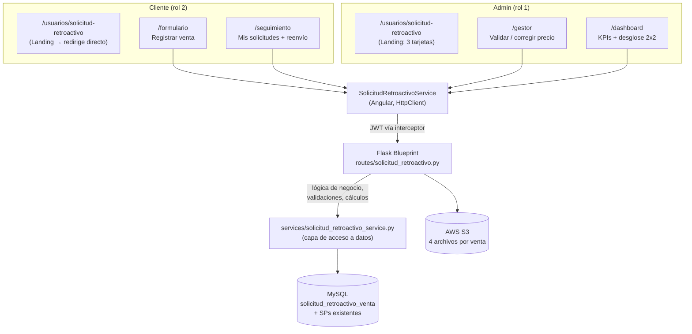

# Solicitud de Retroactivos — Mapa completo del módulo

Este documento cubre **todo** el trabajo hecho sobre el módulo de Solicitud de
Retroactivos, desde que empezamos a tocarlo (sincronizar los repos y
diagnosticar por qué el botón del admin no abría el formulario) hasta el
refactor final de la capa de datos. Pensado para que alguien que no vivió el
proceso pueda entender qué existe hoy, por qué está construido así, y qué
falta.

Todo está en `main` de ambos repos (GitHub). **No está desplegado a
producción.**

---

## 1. Punto de partida

El módulo solo tenía un formulario (`/usuarios/solicitud-retroactivo`) donde
el cliente capturaba una venta a MSI y subía 4 archivos (ticket de compra,
voucher de pago, factura PDF, factura XML) directo a S3, vía el stored
procedure `sp_solicitud_retroactivo_crear_venta`. No existía nada para que un
admin revisara, aprobara o le diera seguimiento a lo que los clientes
capturaban — ni un botón que llevara a algún lado dentro de la app.

---

## 2. Línea de tiempo — qué se construyó y en qué orden

### Fase 1 — Poner el módulo a funcionar
- Los repos locales estaban desincronizados del remoto; se jaló lo último de
  ambos (`EB_BACK` y `EB_FRONT`).
- Bug: el botón "Solicitud de Retroactivos" en el monitor de ventas mandaba
  al admin al home en vez de abrir el formulario. Causa: el guard de rutas
  (`usuarioGuard`) no dejaba pasar al rol admin por esa ruta. Se agregó la
  ruta a la lista de rutas permitidas para usuario **y** admin.
- Bug: el formulario mostraba "Campos de texto faltantes" incorrectamente al
  cargar.

### Fase 2 — Primer panel admin
- Petición: agregar el monto ($10,000 capturado por el cliente) como algo
  que el **admin** pudiera corregir (no el cliente), y rediseñar todo el
  módulo "inspirado en garantías, para tener el mismo formato".
- Se armó el primer Gestor de Respuestas + Dashboard, con acceso vía una
  landing con 3 tarjetas para el admin.
- Bugs encontrados y corregidos en el camino:
  - **Archivos huérfanos en S3**: la key que se guardaba en BD se fabricaba
    a mano (`f"retroactivos/{numero_serie}_..."`) y nunca era la key real
    que `subir_archivo_s3` le asignaba al objeto. Se corrigió subiendo a S3
    **primero** y usando la key real que S3 devuelve, tanto en el registro
    inicial como en cualquier reedición.
  - **`id_marca_bicicleta = 0` violaba la FK** cuando no se seleccionaba
    marca — se cambió el default a `None`.
- Decisión de producto (confirmada con el usuario): el precio lo corrige el
  admin directo, comparándolo contra la factura/ticket adjuntos — campo
  editable en línea + botón guardar, en vez de rechazar toda la solicitud
  por un typo del cliente.

### Fase 3 — Validación por documento, no por solicitud completa
- Petición: "puede ser que suban todo bien a excepción de un archivo... sería
  injusto regresarles todo". Se cambió el modelo de aprobar/rechazar la
  solicitud completa a **validar cada uno de los 4 documentos por
  separado**. El estatus general de la solicitud se deriva de eso
  (`_calcular_estatus`, ver sección 5).
- El Gestor se rediseñó con la estructura maestro-detalle exacta de
  garantías (lista a la izquierda + panel de detalle a la derecha).

### Fase 4 — Dashboard con números reales
- El dashboard se rediseñó varias veces hasta calzar con lo pedido:
  **Totales Generales, Por Campaña, Por Cliente, Por Año Modelo**, con el
  mismo orden y estructura que el dashboard de garantías.
- Las tarjetas KPI y las filas de los rankings se hicieron interactivas: clic
  en una KPI o en una fila abre un detalle/lista **sin navegar a otra
  ruta** — es un estado interno del mismo componente (`vista:
  'dashboard' | 'lista'`), calcado del mismo patrón que ya usa garantías.
  Esto se corrigió después de que la primera versión navegaba al Gestor y
  "Volver" mandaba a un lugar inesperado.

### Fase 5 — Historial de auditoría + reenvío del cliente
- Petición: que la pantalla de Seguimiento del cliente mostrara "todos los
  datos, los validados, el historial de cambios" y dejara "subir los que
  estén rechazados".
- Se agregó la columna `historial_json` (bitácora de auditoría: creación,
  validación por documento, corrección de precio, reenvío — cada una con
  fecha).
- Se descubrió que `mis-solicitudes` no regresaba ni los archivos (URLs) ni
  el historial — el cliente no podía ver nada de lo que había subido. Se
  corrigió.
- Se construyó el endpoint `PUT /venta/<id>` para que el cliente reenvíe
  **solo** el o los archivos rechazados (los ya válidos no se tocan), y la
  vista de Seguimiento se reescribió completa: lista + detalle con
  documentos, estatus por archivo, timeline de historial, y el picker de
  reenvío inline.
- La vista de lista de Seguimiento se rediseñó otra vez para que calzara
  visualmente con "Mis Tickets" de garantías (barra de filtros, tabla,
  badges, paginación) — la primera versión no se parecía.

### Fase 6 — Pulido del Gestor
- El panel de lista del Gestor hacía scroll de toda la página en vez de
  scrollear solo internamente — causa: el layout dependía de `min-height`
  en vez de una altura acotada real, así que el contenedor crecía con el
  contenido. Se corrigió con `height: 100vh` + `overflow: hidden` en
  cascada.
- Se le agregó una barra de filtros más completa: selector de campaña,
  contador de resultados, orden por fecha, y chips de conteo por estatus.

### Fase 7 — Gráfica de distribución en el Dashboard (y un incidente)
- Se agregó un donut "Conteo por Estado" (Chart.js) al dashboard.
- **Incidente**: un rediseño del donut (para eliminar el espacio vacío junto
  a la gráfica) combinó un contenedor con altura `auto` + un *getter* de
  Angular evaluado dentro de un `*ngFor` (recreaba el arreglo en cada ciclo
  de detección de cambios) + el resize automático de Chart.js. Esto generó
  un bucle de re-render que **congeló el navegador por completo** (ni la
  consola de DevTools respondía). Se diagnosticó, se revirtió a la versión
  estable, y se reconstruyó de forma segura: los datos del donut ahora se
  calculan **una sola vez** cuando llegan (no como getter reactivo) y el
  contenedor usa altura fija, nunca automática.
- El donut se rediseñó dos veces más por temas de balance visual (total
  centrado en el hueco de la dona, barras más delgadas) hasta que se integró
  como **una tarjeta más** dentro del mismo grid 2x2 de Campaña / Año
  Modelo / Cliente, en vez de vivir solo arriba con espacio vacío alrededor.

### Fase 8 — Landing del admin con nueva identidad visual
- Se rediseñó la landing de 3 tarjetas del admin con un lenguaje visual tipo
  "bento" (glassmorphism, manchas de color difuminadas de fondo, íconos en
  tiles con degradado, encabezado con texto en degradado), adaptado a la
  paleta naranja/crema de la marca.

### Fase 9 — Separar el acceso a datos de la lógica de negocio
- Se detectó que el módulo se había construido con SQL directo en las rutas
  Flask, rompiendo el patrón del resto del sistema (acceso a datos separado
  de la lógica de negocio, como ya existe en `services/garantias_service.py`).
- Se extrajeron **todas** las consultas SQL y llamadas a stored
  procedures de `routes/solicitud_retroactivo.py` hacia el nuevo
  `services/solicitud_retroactivo_service.py`. La lógica de negocio
  (validaciones, cálculos, armado de JSON, respuestas HTTP) se quedó
  exactamente igual. Se hizo endpoint por endpoint, verificando después de
  cada uno que la respuesta fuera idéntica a la de antes del cambio
  (comparación automatizada contra un snapshot "antes"), y se corrió el
  ciclo completo registrar → validar → rechazar → corregir precio →
  reenviar contra una solicitud de prueba real para confirmar que el
  comportamiento no cambió en nada.
- Alcance respetado: no se tocó ningún otro módulo, ninguna estructura de
  base de datos, ningún stored procedure existente, ni nombres de endpoint,
  parámetros o respuestas JSON.

---

## 3. Arquitectura resultante

- El **frontend** nunca arma SQL ni conoce la BD: todo pasa por
  `solicitud-retroactivo.service.ts`, que a su vez pega al blueprint Flask.
- El **backend** separa en dos capas: `routes/` decide qué hacer (permisos,
  validaciones, cálculos de monto, armado de `historial_json`) y
  `services/` ejecuta el SQL/stored procedure y regresa filas — sin decidir
  nada de negocio.
- Ningún dato "vive calculado" en la BD salvo lo que ya existía (el `%` del
  plan MSI vía `fn_ObtenerPorcentajeMsi`, y el registro que hace
  `sp_solicitud_retroactivo_crear_venta`). Año modelo, estatus general, y el
  historial se derivan/calculan en cada consulta.

---

## 4. Mapa de archivos

### 4.1 Backend (`EB_BACK`)

| Archivo | Rol |
|---|---|
| `routes/solicitud_retroactivo.py` | Blueprint Flask. Todos los endpoints, validaciones, cálculos, subida a S3, respuestas HTTP. |
| `services/solicitud_retroactivo_service.py` | Capa de acceso a datos (17 funciones, una por consulta/SP). No decide nada, solo ejecuta y regresa filas. |

Base de datos: sin cambios de estructura salvo la columna
`solicitud_retroactivo_venta.historial_json` (JSON, sin migración formal —
aplicada a mano en local, pendiente en producción). Los stored procedures
usados (`sp_solicitud_retroactivo_crear_venta`, `_buscar_formulario`,
`_buscar_marca`, `_buscar_msi`, `fn_ObtenerPorcentajeMsi`) ya existían desde
antes y no se modificaron.

### 4.2 Frontend (`EB_FRONT`)

| Archivo / carpeta | Rol |
|---|---|
| `src/app/app.routes.ts` | Registro de las 5 rutas del módulo (ver tabla en sección 6). |
| `src/app/guards/usuario.guard.ts` | Permite que un admin entre a `/formulario` y `/seguimiento` además de un cliente. |
| `src/app/services/solicitud-retroactivo.service.ts` | Wrapper de `HttpClient` con todos los métodos (`listar`, `dashboard`, `validarDocumento`, `corregirPrecio`, `misSolicitudes`, `actualizarVenta`) y los tipos (`SolicitudRetroactivo`, `ItemHistorial`, `ArchivoSolicitud`, `DashboardSolicitudRetroactivo`). |
| `src/app/views/usuarios/solicitud-retroactivo-landing/` | Hub de entrada — decide si redirige al cliente directo al formulario, o muestra las 3 tarjetas al admin. |
| `src/app/views/usuarios/solicitud-retroactivo/` | El formulario de captura (ahora en `/formulario`). |
| `src/app/views/usuarios/solicitud-retroactivo-seguimiento/` | Lista + detalle de "mis solicitudes" del cliente, con historial y reenvío inline. |
| `src/app/views/internal-views/solicitud-retroactivo-gestor/` | Master-detail de revisión para el admin. |
| `src/app/views/internal-views/solicitud-retroactivo-dashboard/` | KPIs + desglose 2x2 + donut de distribución. |

---

## 5. Mapa de endpoints

| Método | Ruta | Quién | Qué hace |
|---|---|---|---|
| POST | `/api/solicitud-retroactivo/registrar/venta` | Cliente | Registra la venta + sube 4 archivos a S3. |
| GET | `/api/solicitud-retroactivo/msi` | Autenticado | Catálogo de meses sin intereses. |
| GET | `/api/solicitud-retroactivo/marca` | Autenticado | Catálogo de marcas. |
| GET | `/api/solicitud-retroactivo/formulario` | Autenticado | Catálogo de campañas. |
| GET | `/api/solicitud-retroactivo/listar` | Admin | Todas las solicitudes, con año modelo, URLs firmadas frescas, estatus por documento e historial. |
| GET | `/api/solicitud-retroactivo/dashboard` | Admin | Totales generales, por campaña, por cliente, por año modelo. |
| POST | `/api/solicitud-retroactivo/validar-documento/<id>` | Admin | Marca UN documento como `valido`/`rechazado`. |
| POST | `/api/solicitud-retroactivo/precio/<id>` | Admin | Corrige el precio público; recalcula `monto_pagar`/`monto_aplicar`. |
| GET | `/api/solicitud-retroactivo/mis-solicitudes` | Cliente (dueño) | Sus solicitudes con archivos (URL + estatus) e historial. |
| PUT | `/api/solicitud-retroactivo/venta/<id>` | Cliente (dueño) | Reenvía solo los archivos rechazados; requiere que algo esté rechazado. |

Rutas del frontend (Angular), con su guard:

| Ruta | Componente | Guard |
|---|---|---|
| `usuarios/solicitud-retroactivo` | `SolicitudRetroactivoLandingComponent` | `usuarioGuard` |
| `usuarios/solicitud-retroactivo/formulario` | `SolicitudRetroactivoComponent` | `usuarioGuard` |
| `usuarios/solicitud-retroactivo/seguimiento` | `SolicitudRetroactivoSeguimientoComponent` | `usuarioGuard` |
| `usuarios/solicitud-retroactivo/gestor` | `SolicitudRetroactivoGestorComponent` | `adminGuard` |
| `usuarios/solicitud-retroactivo/dashboard` | `SolicitudRetroactivoDashboardComponent` | `adminGuard` |

---

## 6. Reglas de negocio y datos clave

- **Estatus por documento, no por solicitud.** `_calcular_estatus()`: si
  algún documento está `rechazado` → la solicitud completa se ve
  `rechazado`; si los 4 están `valido` → `validado`; si no → `pendiente`.
- **Año modelo** no es un campo capturado — se deriva de `fecha_venta` en
  SQL: `MONTH >= 7 ? YEAR+1 : YEAR`, formateado `MYxx`.
- **`historial_json`**: bitácora de auditoría como columna JSON (no una
  tabla nueva). Cada mutación relevante agrega una entrada `{fecha, tipo,
  descripcion}`, con `tipo` = `creacion` / `validacion` / `precio` /
  `reenvio`.
- **Reenvío del cliente**: al `PUT /venta/<id>`, los archivos resubidos se
  quitan del dict de `validacion_docs` (vuelven a "sin revisar"); los que ya
  estaban `valido` no se tocan. El 400 "Solo se pueden editar solicitudes
  con algún archivo rechazado" se dispara si ya no queda nada rechazado.
- **Precio**: el admin lo corrige directo comparándolo contra la
  factura/ticket, sin pasar por el flujo de rechazo/reenvío. El monto se
  recalcula con el `%` del plan MSI ya guardado (no cambia con el precio).
- **Archivos**: siempre se sube a S3 primero y se guarda la key real que S3
  regresa — nunca se fabrica una key a mano (ese fue el bug de archivos
  huérfanos de la Fase 2).

---

## 7. Incidentes registrados (para no repetirlos)

1. **Archivos huérfanos en S3** (Fase 2) — key fabricada en vez de la real.
   Corregido subiendo primero, guardando después.
2. **`id_marca_bicicleta = 0`** (Fase 2) — violaba la FK. Corregido a
   `None` cuando no hay marca.
3. **Congelamiento del navegador** (Fase 7) — un getter de Angular
   reevaluado dentro de un `*ngFor`, junto con un contenedor de altura
   `auto` cerca de un `<canvas>` de Chart.js con `responsive: true`, generó
   un bucle de re-render que bloqueó el hilo principal por completo (no
   solo lentitud — la pestaña dejaba de responder). Si se vuelve a tocar el
   donut del dashboard: **nunca** un getter reactivo dentro de un `*ngFor`
   cerca de un canvas con resize automático; los datos derivados deben
   calcularse una vez y guardarse como propiedad plana.

---

## 8. Estado de despliegue

- **GitHub (`main`)**: subido en ambos repos.
  - `EB_BACK`: commit `afdbc48`.
  - `EB_FRONT`: commit `1e7ae4e`.
- **Producción (EC2)**: **no desplegado.** Pendiente:
  1. Aplicar `historial_json` en la base de datos de producción (mismo
     `ALTER TABLE` corrido en local, sin migración formal).
  2. `git pull` en ambos servidores.
  3. Verificar el flujo completo (registrar → validar/rechazar → corregir
     precio → reenvío) con datos reales antes de darlo por bueno.

---

## 9. Pendientes / notas para retomar

- No hay pruebas automatizadas para este módulo — toda la verificación se
  hizo manualmente vía `curl` contra el servidor local (con tokens de
  admin/cliente) y revisión visual en el navegador.
- El selector de rango de fechas con calendario personalizado que sí tiene
  garantías **no** se replicó en el Gestor de Retroactivos — se optó por
  búsqueda + filtro de campaña + orden por fecha, más simple.
- Falta decidir si `historial_json` y `validacion_docs_json` deberían en
  algún momento vivir en tablas relacionales aparte en vez de columnas JSON
  — se dejaron como JSON a propósito para no agregar migraciones ni tablas
  nuevas mientras el volumen es bajo; si el módulo crece mucho, reconsiderar.
